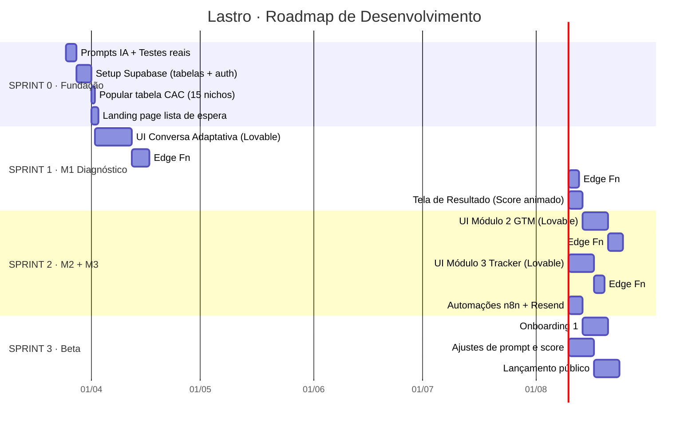

# 🗺️ Lastro — Roadmap de Desenvolvimento
**Versão:** 1.0 · Março 2026  
**Stack:** Lovable + Supabase + Anthropic API + n8n + Resend  
**Horizonte:** ~18 semanas (MVP → Fase 2 → Escala)  
**Autor:** Morgan (PM) · ML Creation Studio

---

> *"O roadmap não é um cronograma. É uma sequência de apostas validadas — cada fase só existe se a anterior provou que o produto tem lastro."*

---

## 📊 Visão Macro — 4 Horizontes



---

## 🔢 Sprint 0 — Fundação Técnica e Validação de IA
**Duração:** ~1,5 semana  
**Objetivo:** Garantir que a base técnica esteja sólida antes de tocar no Lovable.  
**Gate de saída:** Prompts retornando JSONs confiáveis + Supabase operacional.

| # | Tarefa | Ferramenta | Entregável | Tempo |
|---|--------|-----------|-----------|-------|
| 0.1 | **Testar os 4 prompts da Anthropic API** com 10 casos reais da agência | Claude API (Playground) | JSONs validados para P1/P2/P4/P6 com campo `suficiente: boolean` | 3–4h |
| 0.2 | **Criar projeto no Supabase** | Supabase Dashboard | Projeto ativo com URL e chaves | 30min |
| 0.3 | **Criar tabela `diagnostico`** com todos os campos tipados | Supabase Table Editor | Tabela com RLS habilitado | 1–2h |
| 0.4 | **Criar tabela `cac_benchmark`** | Supabase Table Editor | 15 nichos com todos os campos | 1h |
| 0.5 | **Criar tabela `resultado_semanal`** | Supabase Table Editor | Tabela pronta para M3 | 30min |
| 0.6 | **Configurar Supabase Auth** (e-mail + Google) | Supabase Auth | Login funcional | 1h |
| 0.7 | **Popular tabela CAC** com dados de `CAC_NICHOS.md` | Supabase Table Editor | 15 registros inseridos | 1h |
| 0.8 | **Landing page de lista de espera** | Lovable | Página com e-mail + CTA "Quero acesso" | 1–2h |

### ⚠️ Decisões Técnicas Críticas do Sprint 0
- Tipar o objeto `Diagnostico` em TypeScript desde o dia 1 — type centralizado.
- RLS (Row Level Security) ativo nas 3 tabelas — cada usuário vê só seus dados.
- Variáveis de ambiente configuradas: `SUPABASE_URL`, `SUPABASE_ANON_KEY`, `ANTHROPIC_API_KEY`.

---

## 🧠 Sprint 1 — Módulo 1: Diagnóstico de Viabilidade
**Duração:** ~3 semanas  
**Objetivo:** Entregar a experiência core do Lastro — a conversa adaptativa que gera o Score.  
**Gate de saída:** Usuário completa 9 tópicos → Score calculado → tela de resultado renderizada.

### Semana 1–2: Interface da Conversa (Lovable)

| # | Tarefa | Detalhe | Ref. |
|---|--------|--------|------|
| 1.1 | **Tela de Entrada** | Fundo `#080f0c` · "Lastro." teal 72px · tagline italic · 2 CTAs | `UX_FLUXO.md` |
| 1.2 | **Tela de Cadastro/Login** | Campo e-mail + botão Google · conexão Supabase Auth | `ARQUITETURA.md` |
| 1.3 | **Tela de Conversa Adaptativa** | 9 tópicos · pergunta letra por letra (20ms curtas / 14ms longas) · cursor `|` em `#1D9E75` · indicador "X de 9" discreto · loading `· · ·` pulsando | `UX_FLUXO.md` |
| 1.4 | **Lógica de Complementares** | Máx. complementares por tópico (ver tabela de 9 tópicos) · se esgotar, avançar com `confianca: baixa` | `lastro-documento-master.md` |
| 1.5 | **Salvar respostas no Supabase** | Cada resposta → `UPDATE diagnostico SET campo = valor` | `ARQUITETURA.md` |

### Semana 2–3: Edge Functions de Inteligência

| # | Tarefa | Input → Output |
|---|--------|-----------------|
| 1.6 | **Edge Function: `processar-respostas-abertas`** | Respostas P1/P2/P4/P6 → Anthropic API → JSON com `nicho`, `icp_score`, `diferencial_score`, canais testados |
| 1.7 | **Edge Function: `calcular-score`** | Campos do M1 → `budget_midia` (×0.56) → lookup `cac_benchmark` → Score ponderado (Viab. 40% + ICP 25% + Prazo 20% + Mercado 15%) → `zona` |
| 1.8 | **Integração ACSD** | Aplicar impostos BR (12.15% Meta) e sazonalidade no cálculo do CAC ajustado |
| 1.9 | **Integração AELI** | Se score < 40, acionar sugestão de pivot lateral (Oceano Azul) antes de bloquear M2 |

### Semana 3: Tela de Resultado

| # | Tarefa | Detalhe |
|---|--------|--------|
| 1.10 | **Score Animado** | Número cresce de 0 ao valor real em 1.5s · frase por zona |
| 1.11 | **4 Dimensões** | Barras progressivas: Viabilidade · ICP · Prazo · Mercado |
| 1.12 | **Relatório de Viabilidade** | Texto gerado pela IA · tom honesto ("seu budget cobre X clientes") |
| 1.13 | **Plano de Ação** | Ajustado à realidade · alerta se score < 40 |
| 1.14 | **CTA para M2** | Bloqueado visualmente se score < 40 · desbloqueado se ≥ 40 |

---

## 📍 Sprint 2 — Módulos 2 e 3: GTM + Tracker
**Duração:** ~3 semanas  
**Objetivo:** Fechar o ciclo do MVP — do diagnóstico à execução ao monitoramento.  
**Gate de saída:** Plano de 90 dias gerado + tracker semanal funcional + automações n8n ativas.

### Módulo 2 — Mapa de GTM (Semanas 4–5)

| # | Tarefa | Detalhe |
|---|--------|--------|
| 2.1 | **Pergunta "Clientes pagando?"** | Única pergunta nova do M2 — muda completamente o mapa |
| 2.2 | **Edge Function: `gerar-plano-gtm`** | Integra lógica do *Lastro AEE* (Hard Gates de canal) |
| 2.3 | **Tela de Canais Recomendados** | Ranking com justificativa + canais bloqueados com motivo |
| 2.4 | **Plano de 90 Dias** | Semana a semana · 3 métricas com metas numéricas |
| 2.5 | **Alerta semana 4** | Se resultado < 40% da meta → trigger automático |

**Regras de seleção (AEE integrado):**
```
budget_midia < R$600          → bloqueia tráfego pago
budget / CAC < 3              → bloqueia mesmo com budget ok
icp_score < 40                → bloqueia canais pagos
prazo == 30 dias              → bloqueia orgânico e SEO
ticket < R$200                → bloqueia LinkedIn e outbound
clientes_pagando == false     → bloqueia anúncios, começa indicação
```

### Módulo 3 — Tracker de Resultado (Semanas 5–6)

| # | Tarefa | Detalhe |
|---|--------|--------|
| 3.1 | **Dashboard semanal** | Status: No Prazo / Atenção / Revisão · 3 métricas |
| 3.2 | **Entrada de dados (v1)** | Manual: 3 campos por semana (investimento, resultado, canal) |
| 3.3 | **Edge Function: `calcular-desvio`** | 4 causas possíveis · texto de correção *Lastro AUD* (UX Defensiva) |
| 3.4 | **Retroalimentação AFP** | CAC real → atualiza `cac_benchmark` (85% histórico + 15% novo dado) |

### Automações n8n + Resend (Semana 6)

| # | Workflow | Trigger | Ação |
|---|----------|---------|------|
| 3.5 | Touchpoint Dia 7 | `created_at + 7d` | E-mail: "Campanha foi ao ar?" |
| 3.6 | Touchpoint Dia 30 | `created_at + 30d` | E-mail: link para registro de resultado |
| 3.7 | Touchpoint Dia 60 | `created_at + 60d` | E-mail: resultado final + novo score |
| 3.8 | Alerta Desvio Semana 4 | `resultado_semanal.semana == 4` | E-mail de alerta + diagnóstico |

---

## 🧪 Sprint 3 — Beta Fechado e Lançamento
**Duração:** ~3 semanas  
**Objetivo:** Validar o produto com humanos reais e ajustar antes do público.  
**Gate de saída:** 30 diagnósticos completos + 10 depoimentos + score calibrado.

### Semana 7–8: Beta Fechado

| # | Tarefa | Detalhe |
|---|--------|--------|
| 4.1 | **Seleção dos 30 usuários** | 10 ex-clientes agência + 10 founders SaaS + 10 gestores PME |
| 4.2 | **Onboarding 1:1 nos primeiros 10** | Videochamada ou WhatsApp em tempo real · observar onde travam |
| 4.3 | **Ajustar prompts da IA** | Refinar extrações com base em respostas reais |
| 4.4 | **Calibrar pesos do Score** | Se necessário, ajustar os 4 pesos (40/25/20/15) |
| 4.5 | **Coletar depoimentos dia 7** | "O que mudou na sua visão depois do diagnóstico?" |
| 4.6 | **Corrigir bugs críticos** | Priorizar tudo que impede conclusão do diagnóstico |

### Semana 8–9: Lançamento Público

| # | Tarefa | Detalhe |
|---|--------|--------|
| 4.7 | **Post de revelação (Semana 8)** | Print do score animado + depoimento mais forte |
| 4.8 | **Ativar lista de espera** | E-mail via Resend: "Seu acesso está pronto" |
| 4.9 | **Contato direto com 20 agências** | WhatsApp/LinkedIn DM personalizado |
| 4.10 | **Lançamento D-Day (Semana 9)** | LinkedIn às 9h terça · Product Hunt · comunidades BR |
| 4.11 | **Primeiro relatório público de CAC** | Dados anonimizados do beta (mín. 30 diagnósticos) |

---

## 🚀 Horizonte 2: Fase de Direção (Pós-MVP · Semanas 10–16)
**Pré-requisito:** MVP validado com retenção comprovada.  
**Objetivo:** Construir M4–M9 e lançar o plano Direção (R$197/mês).

| Sprint | Módulo | Entregável | Dependências |
|--------|--------|-----------|-------------|
| S4 | **M9 — Copy e Narrativa** | Tagline, pitches, copy por canal, bios | M1 |
| S4 | **M4 — Direção de Arte** | Paleta, tipografia, mood board, anti-patterns | M1 |
| S5 | **M7 — Direção Social Media** | Pilares, calendário 30d, frequência, tom por rede | M1 + M2 |
| S5 | **M5 — Direção Webdesign** | Wireframe textual LP, copy por bloco, CTAs | M1 + M4 |
| S6 | **M6 — Direção Executiva** | Resumo C-level, ROI, plano 90d board-friendly | M1 + M2 |
| S6 | **M8 — Direção Gravações** | Lista priorizada, ganchos, roteiros, specs técnicas | M1 + M7 |

> **Regra:** Plano Direção (R$197) só é comercializado após todos os 6 módulos estarem prontos e testados.

---

## 🔬 Horizonte 3: Fase de Inteligência (Semanas 17–24+)
**Pré-requisito:** Fase 2 validada + volume mínimo de dados acumulados.  
**Objetivo:** Construir M10–M13 e lançar o plano Completo (R$397/mês).

| Sprint | Módulo | Entregável | Dependências |
|--------|--------|-----------|-------------|
| S7 | **M10 — Tráfego Pago** | Estrutura campanha, públicos, copy anúncios, critérios escala | M1 + M2 + M9 |
| S7 | **M11 — Funil e Conversão** | Mapa do funil, gargalo, custo em R$/mês, correção | M1 + M3 |
| S8 | **M12 — Direção de Lançamento** | Cronograma, pré-aquecimento, e-mails, plano B | M1 + M2 + M9 |
| S8 | **M13 — Inteligência de Mercado** | Benchmarks agregados, tendências, experimentos | 500+ usuários |

> **M13 é o módulo que diferencia o Lastro de qualquer concorrente futuro.** Ele transforma dado proprietário em produto de assinatura premium + autoridade pública.

---

## 🔮 Horizonte 4: Expansão e Escala (Mês 6+)

| Prioridade | Iniciativa | Racional |
|-----------|-----------|---------|
| 1 | **Integração Meta Ads API (v2)** | Reduzir fricção de input no M3 |
| 2 | **Plano Agência white-label** | R$597/mês × N agências = multiplicador de MRR |
| 3 | **Relatório público trimestral de CAC** | Autoridade de mercado + distribuição orgânica |
| 4 | **Google Ads + LinkedIn API (v3)** | Hub unificado multi-canal |
| 5 | **Integração ADA completa** | Sala de Guerra automatizada com Stop-Loss |
| 6 | **App mobile** | Acompanhamento em tempo real do tracker |

---

## 📐 Regras Inegociáveis do Roadmap

| # | Regra | Consequência se quebrada |
|---|-------|------------------------|
| 1 | M1 sempre gratuito e completo | Perda do efeito de porta de entrada |
| 2 | Score < 40 bloqueia M2 | Quebra a credibilidade do produto |
| 3 | Não adicionar feature antes de validar a anterior | Escopo descontrolado |
| 4 | Prompts versionados, nunca sobrescritos | Impossibilidade de debug |
| 5 | Tabela CAC editável sem deploy | Dependência desnecessária de dev |
| 6 | Fase 2 só lança quando todos os módulos estão prontos | Venda de promessa, não de produto |
| 7 | Objeto de diagnóstico único — usuário nunca repete info | UX degradada |

---

## 📈 Projeção de MRR por Marco do Roadmap

| Marco | Composição | MRR Estimado |
|-------|-----------|-------------|
| Sprint 3 (Mês 3) — Beta | 10 free · 8 Estratégia · 2 agências | **R$1.826** |
| Horizonte 2 (Mês 6) — Fase 2 | 100 free · 30 Est. · 15 Dir. · 8 agências | **R$8.511** |
| Horizonte 3 (Mês 12) — Tração | 400 free · 80 Est. · 50 Dir. · 20 Comp. · 20 ag. | **R$33.660** |
| Horizonte 4 (Mês 18) — Escala | 1.000 free · 180 Est. · 120 Dir. · 60 Comp. · 50 ag. | **R$88.410** |

*Premissas: conversão free→pago 8–10% · sem canal pago · crescimento orgânico*

---

*— Morgan, planejando o futuro 📊*
